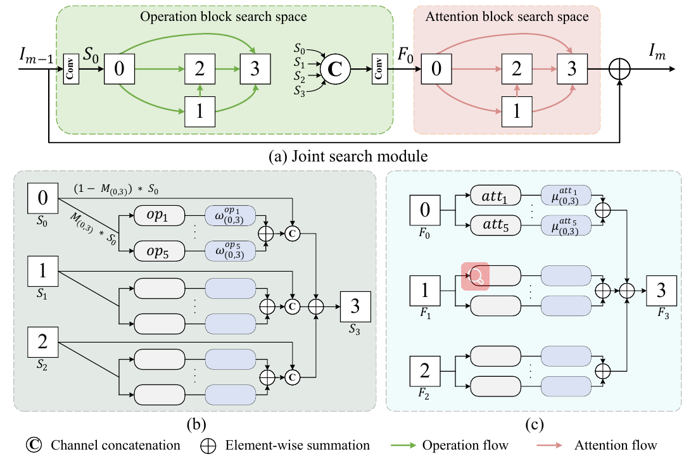
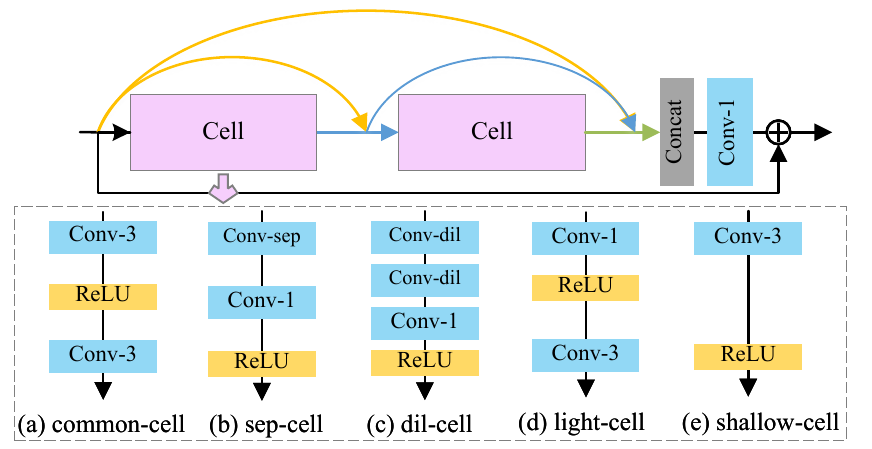
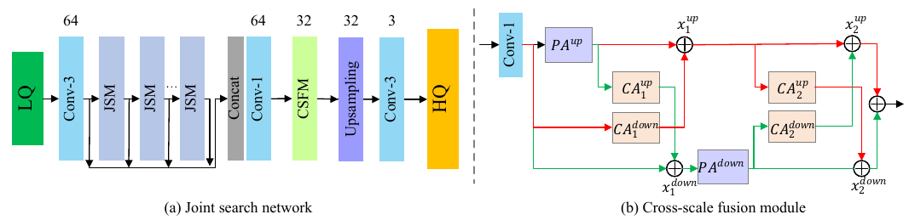

# JSNet
This repository is for JSNet introduced in the following paper: Hao Shen, Zhong-Qiu Zhao, Wenrui Liao, Weidong Tian,  and De-Shuang Huang, "Joint Operation and Attention Block Search for Lightweight Image Restoration", (Accepted by Pattern Recognition)

[[Paper\]](https://www.sciencedirect.com/science/article/pii/S0031320322003909?via%3Dihub) 

## Requirements

The code is mainly built based on [RNAN](https://github.com/yulunzhang/RNAN).

- Python 3.6
- PyTorch == 1.0.1
- torchvision == 0.2.0
- numpy
- skimage
- cv2

### Introduction

Recently, block-based design methods have shown effectiveness in image restoration tasks, which are usually designed in a handcrafted manner and have computation and memory consumption challenges in practice. In this paper, we propose a joint operation and attention block search algorithm for image restoration, which focuses on searching for optimal combinations of operation blocks and attention blocks. Specifically, we first construct two search spaces: operation block search space and attention block search space. The former is used to explore the suitable operation of each layer and aims to construct a lightweight and effective operation search module (OSM). The latter is applied to discover the optimal connection of various attention mechanisms and aims to enhance the feature expression. The searched structure is called the attention search module (ASM). Then we combine OSM and ASM to construct a joint search module (JSM), which serves as the basic module to build the final network. Moreover, we propose a cross-scale fusion module (CSFM) to effectively integrate multiple hierarchical features from JSMs, which helps to mine feature corrections of intermediate layers. Extensive experiments on image super-resolution, gray image denoising, and JPEG image deblocking tasks demonstrate that our proposed network can achieve competitive performance. 

### Proposed Methods

1. **The proposed Joint Search Module** 



2. **The architecture of the candidate operation block and its components**



3.  **The overall architecture of the proposed joint search network (JSNet)**



### Experiments

1. **Super-resolution task**


2. **Image denoising task**


3. **JPEG image deblocking task**


4. **Model complexity**


### Citation

```pyhton
@inproceedings{zhang2019rnan,
    title={Residual Non-local Attention Networks for Image Restoration},
    author={Zhang, Yulun and Li, Kunpeng and Li, Kai and Zhong, Bineng and Fu, Yun},
    booktitle={ICLR},
    year={2019}
}
@inproceedings{liao2021residual,
  title={Residual Attention Block Search for Lightweight Image Super-Resolution},
  author={Liao, Wenrui and Zhao, Zhong-Qiu and Shen, Hao and Tian, Weidong},
  booktitle={2021 IEEE International Conference on Multimedia and Expo (ICME)},
  pages={1--6},
  year={2021},
  organization={IEEE}
}
@inproceedings{shen2022joint
  title={Joint Operation and Attention Block Search for Lightweight Image Restoration},
  author={Shen, Hao and Liao, Wenrui and Zhao, Zhong-Qiu and Tian, Weidong and huang de-shuang},
  journal={Pattern Recognition} 
  year={2022}
}
```

